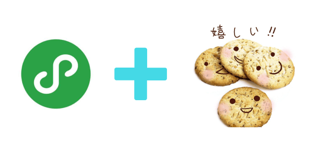

# 本仓库 Fork 自[charleslo1/weapp-cookie: 一行代码让微信、头条、百度、支付宝小程序支持 cookie，兼容 uni-app 🍪🚀 One line of code allows weapp to support cookie（wx weixin wxapp cookie） (github.com)](https://github.com/charleslo1/weapp-cookie)

## Fork时间：2023-5-21；版本：1.4.6；

## 修改内容：


---

## 以下为原作者的README：

---


# weapp-cookie
> 一行代码让微信、头条、百度、支付宝小程序支持 cookie，兼容 uni-app



# Intro
小程序原生的 request 网络请求接口并不支持传统的 Cookie，但有时候我们现有的后端接口确于依赖 Cookie（比如服务器用户登录态），这个库可用一行代码为你的小程序实现 Cookie 机制，以保证基于 cookie 的服务会话不会失效，与 web 端共用会话机制

# Featrues
- [x] 一行代码让小程序支持 cookie
- [x] 可使用 api 获取、设置 cookie
- [x] 支持 domain/path 作用域

# Install

``` sh
npm install weapp-cookie --save

# 将 npm 包复制到 vendor 文件夹，避免小程序可能不能找到文件（Tips：支持npm包的开发环境无需此步）
cp -rf ./node_modules/ ./vendor/
```

# Usage
以微信小程序为例，在小程序根目录的 app.js 一行代码引入即可

``` js
// app.js
import './vendor/weapp-cookie/dist/weapp-cookie'

// tips: 使用 uni-app/wepy/mpvue 等支持npm包的环境可以直接在入口 js 引入 weapp-cookie 模块
// import 'weapp-cookie'

App({
    onLaunch: function () { }
    // ...
})
```

原来的 wx.request 调用方式保持不变，引入后 weapp-cookie 会在底层自动代理 wx.request 的接口访问，以支持 cookie 存储和发送

``` js
// pages/home/index.js

Page({
    onLoad: function () {
        wx.request({
            url: 'https://example.com/login',
            data: {
                username: 'admin',
                password: '123456'
            },
            success: function (res) {
                /*
                 * 接口调用成功后 weapp-cookie 会自动保存后端发送的所有Cookie（比如：SessionID）
                 * 并在后续的所有请求中带上，以保证基于 cookie 的服务器会话机制不会失效，
                 * 实现与 web 端共用会话机制（无需再手动维护 3rd_session_key） 
                 */
            }
        })
    }
})
```

cookie 操作可通过 api 调用

``` js
import cookies from 'weapp-cookie'

// 获取 cookie
let token = cookies.get('csrf_token', 'example.com')

// 设置 cookie
let cookie = cookies.set('uid', 100, { domain: 'example.com' })

// 删除 cookie
let isRemoved = cookies.remove('uid', 'example.com')

// 判断是否存在 cookie
let hasToken = cookies.has('uid', 'example.com')

// ... 详情请参考 Api

```

使用和配置别名：由于微信小程序的安全机制，[在小程序插件环境下 wx.request 不允许被重写](https://developers.weixin.qq.com/community/develop/doc/000cc0f0c70250ea51e6faa6156400)，所以需使用内置别名或自定义别名来支持 cookie 请求

```
import cookies from 'weapp-cookie'

// 使用内置别名
wx.requestWithCookie({
    url: 'https://example.com/user/current',
    success: function (res) {
        console.log(res)
    }
})

// 配置自定义别名
cookies.config({ requestAlias: 'requestx' })

// 使用自定义别名
wx.requestx({
    url: 'https://example.com/user/current',
    success: function (res) {
        console.log(res)
    }
})
```

# Api

## CookieStore
``` js
import cookies from 'weapp-cookie'

/**
* 获取 cookie 值
* @param {String} name       cookie 名称
* @param {String} [domain]   指定域名（可选）
* @return {String}           cookie 值
*/
cookies.get(String name, String domain)

/**
* 设置 cookie
* @param {String}  name              cookie 名称
* @param {String}  value             cookie 值
* @param {Object}  options           cookie 选项
* @param {String}  options.domain    设置域名
* @param {String}  [options.path]      
* @param {Date}    [options.expires]
* @param {Number}  [options.maxAge]
* @param {Boolean} [options.httpOnly]
* @return {Cookie}           cookie 对象
*/
cookies.set(String name, String value, Object options)

/**
* 是否存在某个 cookie
* @param  {String}  name       cookie 名称
* @param  {String}  [domain]   指定域名（可选，不指定则任意域名包含名称为 name 的 cokkie 即为存在）
* @return {Boolean}            是否存在
*/
cookies.has(String name, String domain)

/**
* 删除 cookie
* @param  {Array}  name      cookie 键
* @param  {String} [domain]  指定域名（可选，不指定则删除所有域名中名称为 name 的 cookie）
* @return {Boolean}          是否删除成功
*/
cookies.remove(String name, String domain)

/**
* 获取 cookie 对象
* @param {String} name       cookie 名称
* @param {String} [domain]   指定域名（可选）
* @return {Cookie}           cookie 对象
*/
cookies.getCookie(String name, String domain)

/**
* 获取 cookies JSON对象
* @param  {String} [domain]  指定域名（可选，不指定则获取包含所有域名的 cookie 值对象）
* @return {Object}           cookie JSON对象
*/
cookies.getCookies(String domain)

/**
* 清除 cookie
* @param  {String} [domain]  指定域名（可选，不指定则清除所有域名 cookie）
* @return {Boolean}          是否清除成功
*/
cookies.clearCookies (domain)

/**
* 获取所有存储的域名和 cookies 结构
* @return {Object}   obj   结构JSON对象
*/
cookies.dir(domain)

```

## Cookie
``` js
import cookies from 'weapp-cookie'

// 获取 cookie 对象
let cookie = cookies.getCookie('uuid', 'example.com')

// ===== cookie 属性 =====
cookie.name:        String
cookie.value:       String
cookie.domain:      String
cookie.path:        String
cookie.expires:     Date
cookie.maxAge:      Number
cookie.httpOnly:    Boolean

// ===== cookie 方法 =====

/**
 * 验证 cookie 是否过期
 * @return {Boolean} 是否过期
 */
cookie.isExpired()

/**
 * 验证 cookie 是否可持久化
 * @return {Boolean} 是否可持久化
 */
cookie.isPersistence()

```


如果对你有用，欢迎 star ^_^

